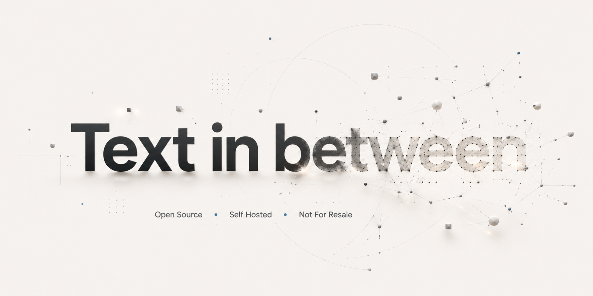
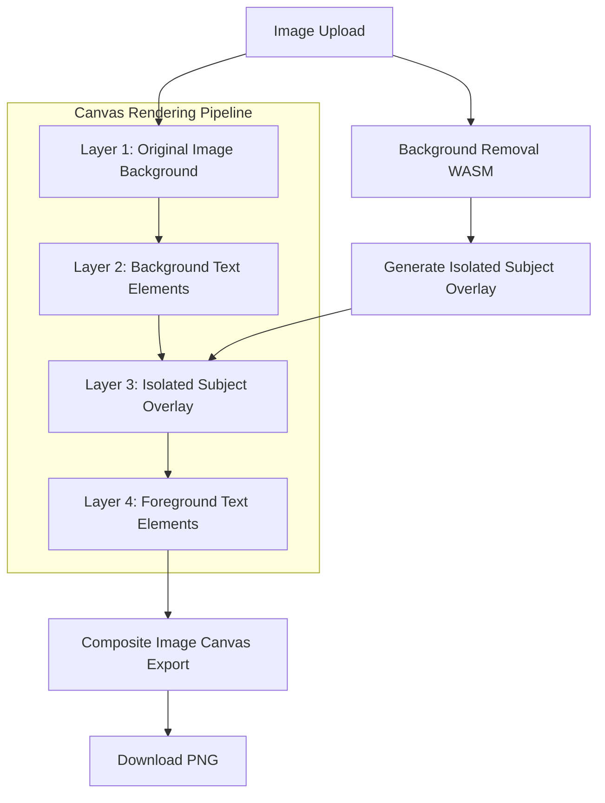

# text-in-between

Auto-insert typography layers behind the subject in your images. Ideal for high-engagement YouTube thumbnails, visual overlays, and social media posts.



<div align="center">

[](LICENSE)
[](https://nextjs.org/)
[](https://tailwindcss.com/)
[](https://img.slate.co/)
[](https://clerk.com/)
[](https://convex.dev/)

</div>

---

## 🚀 Overview

**text-in-between** is a modern, minimal, Apple-style SaaS application designed to instantly isolate the subject of any image using client-side WASM background removal, allowing you to sandwich multiple fully customizable text layers behind the subject and in front of the background.

### 📊 Layer Composition Flow



---

## ✨ Features

- 🖼️ **Client-Side WASM Separation:** Powered by `@imgly/background-removal` for zero-server-latency background masking.
- ✍️ **Dynamic Canvas Text Engine:**
  - Import hundreds of font families dynamically via WebFontLoader.
  - Interactive font size, weight, color, rotation, vertical/horizontal placement, and letter spacing sliders.
  - Layer-level switches to toggle text between foreground (above subject) and background (behind subject).
  - Clean drop-shadow overlays to make text readable on busy backgrounds.
- ⚙️ **Image Enhancements:** Live brightness and contrast adjustment sliders for the background plate.
- 🔒 **SaaS Readiness:** Powered by **Clerk** authentication and **Convex** real-time serverless database.
- 🍎 **Premium Apple-Style UI:** Beautiful minimalist off-white aesthetic with crisp dark-gray details, custom fonts (`Plus Jakarta Sans`), and clean rounded layouts.

---

## 🛠️ Tech Stack

<div align="left">
  <table>
    <tr>
      <td><b>Framework</b></td>
      <td>Next.js 15 App Router (React 19)</td>
    </tr>
    <tr>
      <td><b>Styling</b></td>
      <td>Tailwind CSS v4 (with tw-animate-css)</td>
    </tr>
    <tr>
      <td><b>Authentication</b></td>
      <td>Clerk Next.js SDK</td>
    </tr>
    <tr>
      <td><b>Database</b></td>
      <td>Convex Realtime Backend</td>
    </tr>
    <tr>
      <td><b>Processing</b></td>
      <td>@imgly/background-removal (WebAssembly)</td>
    </tr>
    <tr>
      <td><b>Animations</b></td>
      <td>Motion (Framer Motion v12)</td>
    </tr>
  </table>
</div>

---

## ⚙️ Getting Started

### Prerequisites

- Node.js (v18+)
- npm / pnpm / bun
- Clerk & Convex credentials (set up in environment variables)

### Installation

1. **Clone the repository:**
   ```bash
   git clone https://github.com/Lalitmukesh69/text-in-between.git
   cd text-in-between
   ```

2. **Install dependencies:**
   ```bash
   npm install
   ```

3. **Configure Environment Variables:**
   Create a `.env.local` file at the root:
   ```env
   # Clerk Credentials
   NEXT_PUBLIC_CLERK_PUBLISHABLE_KEY=your_clerk_pub_key
   CLERK_SECRET_KEY=your_clerk_secret_key
   NEXT_PUBLIC_CLERK_SIGN_IN_URL=/sign-in
   NEXT_PUBLIC_CLERK_SIGN_UP_URL=/sign-up

   # Convex Credentials
   NEXT_PUBLIC_CONVEX_URL=your_convex_endpoint
   ```

4. **Run Convex Dev Server:**
   ```bash
   npx convex dev
   ```

5. **Start Next.js Development Server:**
   ```bash
   npm run dev
   ```

6. Open [http://localhost:3000](http://localhost:3000) to view your local deployment.

---

## 📄 License

This project is licensed under the MIT License - see the [LICENSE](LICENSE) file for details.
